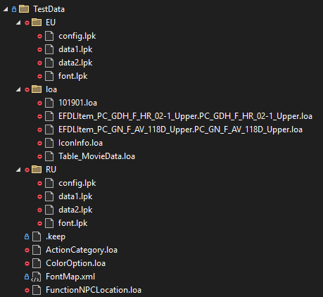

# LpkTool Library

## A library to unpack and repack Lost Ark .lpk files.

## Game Patcher Usage

- Place Patches in `Documents/LostArk/Patches`
- Run the LostArkPatch
- Profit

## Example Patches

[Examples can be found here](./LostArkPatcher/Examples/)

## Unit Tests

You need to grab test files from your own game install and place them like this for the unit tests.  
  
You can use the lpk export tool to grab the `*.loa` files.
